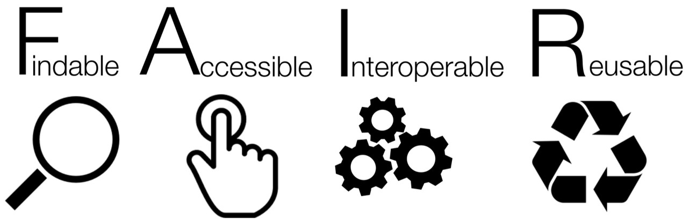

<!--

author:   Britta Petersen
email:    b.petersen@rz.uni-kiel.de
version:  0.1.0
language: de
narrator: DE German Female

icon:     images/Logo_cau-norm-de-lilagrey-rgb-0720_2022.png

comment:  This document provides a brief introduction to research data management.

-->

# Biol-116 - Disclaimer

>**Britta Petersen, Cleo Michelsen**
>
>Central Research Data Management of Kiel University
>
>**Disclaimer**: Please note that you are leaving the CAU pages once you open this presentation in your browser. This presentation includes links to other third party websites and services. When you click on these links you will leave this presentation and will be redirected to the respective another sites. These sites are not under our control.
>
>RDM@CAU is not responsible for the content of linked third party websites. Please be aware that the security and privacy policies on these sites may be different than CAU policies, so please read third party privacy and security policies closely.
>
> To see this document as an interactive LiaScript rendered version, click on the
> following link/badge:
>
> 
>
> If you need help, feel free to ask us any questions:
>
> [b.petersen@rz.uni-kiel.de](mailto:b.petersen@rz.uni-kiel.de)
>
> ____________________________________________
>
>  This work is licensed under a [Creative Commons Attribution 4.0 International License](https://creativecommons.org/) with exception of the used material from other copyright holders.

# Forschungsdatenmanagement

TinyURL zu dieser Präsentation: http://tinyurl.com/biol116-FDM

  
    Illustration: Cleo Michelsen

# Forschungsdaten?

{{0-1}}
********************************************************************************

> <!-- style="width: 20%; float:right" -->
>
>**Lassen Sie uns kurz gemeinsam sammeln!**
>
>* Welche Beispiele für Forschungsdaten können Sie nennen?
>
>https://answergarden.ch/4024842
>
> Sie dürfen so viele Begriffe eingeben, wie Sie möchten.

---

********************************************************************************

{{1-2}}
********************************************************************************

<iframe src="https://answergarden.ch/4024842" style="border:0px;width:100%;height:500px" allowfullscreen="true" webkitallowfullscreen="true" mozallowfullscreen="true"></iframe>

********************************************************************************

{{2-3}}
********************************************************************************
Die DFG schreibt hierzu:

> „Zu Forschungsdaten zählen u. a. Messdaten, Laborwerte, audiovisuelle Informationen, Texte, Surveydaten oder Beobachtungsdaten, methodische Testverfahren sowie Fragebögen. Korpora und Simulationen können ebenfalls zentrale Ergebnisse wissenschaftlicher Forschung darstellen und werden daher ebenfalls unter den Begriff Forschungsdaten gefasst. Da Forschungsdaten in einigen Fachbereichen auf der Analyse von Objekten basieren (z. B. Gewebe-, Material-, Gesteins-, Wasser- und Bodenproben, Prüfkörper, Installationen, Artefakte und Kunstgegenstände), muss der Umgang mit diesen ebenso sorgfältig sein und eine fachlich adäquate Nachnutzungsmöglichkeit, wann immer sinnvoll und möglich, mitgedacht werden. Ähnliches gilt, wenn Software für die Entstehung oder Verarbeitung von Forschungsdaten erforderlich ist.“
>
> (**DFG 2021**)

********************************************************************************

{{3-4}}
********************************************************************************

Etwas weniger kompliziert definierte das PrePARe Projekt der Camebridge University den Begriff Forschungsadaten:

> “Any any information you use in your research.”
>
> (**University of Camebridge PrePARe Project**)

********************************************************************************

{{4}}
********************************************************************************

 <!-- width="350px" align="right" -->

**Beispiele für Forschungsdaten**:

- Audio- und Videoaufzeichnungen
- Tagebücher
- Daten aus geografischen Informationssystemen (GIS)
- Labor- und Feldnotizen
- Modell-, Skript- und Forschungssoftwarecode
- Bilder und Abbildungen
- Fragebögen und Codebücher
- Proben und Artefakte
- Sensor-Daten
- Sequenzierdaten
- Spektren
- Text- und Tabellenkalkulationsdokumente
- Textkorpora und Annotationen
- Topographie-Daten
- Abschriften

********************************************************************************

# Forschungsdatenmanagement?

 <!--
style="width: 20%; max-width: 800px; float:right"
title="Zusammenarbeit"
onclick="alert('Let´s work together!');"
-->

**Tauschen Sie sich bitte kurz mit einer benachbarten Person aus.**

* Spekulieren Sie darüber, welche Tätigkeitsbereiche und Fragestellungen zum Management von Forschungsdaten gehören könnten.

---

{{1}}
********************************************************************************

> Forschungsdatenmanagement (FDM) umfasst die Prozesse der **Transformation**, **Selektion** und **Speicherung** von Forschungsdaten mit dem gemeinsamen **Ziel**, diese *langfristig* und *personenunabhängig* **zugänglich**, **nachnutzbar** und **nachprüfbar** zu halten.
>
>(**forschungsdaten.info**)

********************************************************************************

# Ziel: FAIRe Daten

Daten langfristig und personenunabhängig zugänglich, nachnutzbar und nachprüfbar halten.
---

***--> Den Original Artikel finden Sie [hier](https://www.nature.com/articles/sdata201618).***

.") <!-- width="500px" -->

{{1}}
********************************************************************************

********************************************************************************

{{2}}
>**F**indable

{{3-4}}
****************
Der erste Schritt bei der (Wieder-)Verwendung von Daten besteht darin, sie zu finden. Metadaten und Daten sollten sowohl für Menschen als auch für Computer leicht zu finden sein. Maschinenlesbare Metadaten sind für das automatische Auffinden von Datensätzen und Diensten unerlässlich und daher ein wesentlicher Bestandteil des FAIRification-Prozesses.

F1. (Meta)data are assigned a globally unique and persistent identifier

F2. Data are described with rich metadata (defined by R1 below)

F3. Metadata clearly and explicitly include the identifier of the data they describe

F4. (Meta)data are registered or indexed in a searchable resource

***************

{{3}}
>**A**ccessible

{{4-5}}
***********************
Sobald der Nutzer die gewünschten Daten gefunden hat, muss er wissen, wie er auf sie zugreifen kann, möglicherweise einschließlich Authentifizierung und Autorisierung.

A1. (Meta)data are retrievable by their identifier using a standardised communications protocol

A1.1 The protocol is open, free, and universally implementable

A1.2 The protocol allows for an authentication and authorisation procedure, where necessary

A2. Metadata are accessible, even when the data are no longer available

******************

{{4}}
>**I**nteroperable

{{5-6}}
**********************
Daten sollten in einer Form vorliegen, die die Nutzung mit diversen Anwendungen oder Arbeitsabläufen für die Analyse, Speicherung und Verarbeitung ermöglichen.

I1. (Meta)data use a formal, accessible, shared, and broadly applicable language for knowledge representation.

I2. (Meta)data use vocabularies that follow FAIR principles

I3. (Meta)data include qualified references to other (meta)data

**********************

{{5}}
>**R**eusable

{{6-7}}
***************
Das Ziel von FAIR ist es, die Wiederverwendung von Daten zu optimieren. Um dies zu erreichen, sollten Metadaten und Daten gut dokumentiert und beschrieben sowie mit einer eindeutigen Angabe bzgl. der Nutzungsbedingungen (Lizenzen) versehen sein.

R1. Meta(data) are richly described with a plurality of accurate and relevant attributes

R1.1. (Meta)data are released with a clear and accessible data usage license

R1.2. (Meta)data are associated with detailed provenance

R1.3. (Meta)data meet domain-relevant community standards

**************

# Forschungsdatenlebenszyklus

Prozesse der Transformation, Selektion und Speicherung von Forschungsdaten entlang des Forschungsdatenlebenszyklus...

{{0-1}}
************

 <!-- width="500px" -->

************

{{1-2}}
********************************************************************************
 <!-- width="150px" align="right" -->

**Planung**:

* Werden Daten wiederverwendet?
* Brauche ich eine Erlaubnis, um die Daten nachzunutzen oder zu erheben?
* Wem gehören die Daten, die ich erhebe?
* Welche Erhebungsmethode ist angemessen?
* Welche Datendokumentation ist angemessen und notwendig?
* Welches Datenvolumen ist zu erwarten?
* Welche Datentypen, im Sinne von Datenformaten (z. B. Bilddaten, Textdaten oder Messdaten in Tabellen) entstehen?
* Wie sieht eine sichere Datenaufbewahrung aus?
* Wer hat Zugang zu meinen Daten?
* Wer ist verantwortlich?
* Welche Rechte habe ich, um die Daten zu publizieren?

---

********************************************************************************

{{2-3}}
********************************************************************************
 <!-- width="150px" align="right" -->

**Erhebung und Analyse**:

* Welche Ansätze werden verfolgt, um die Daten kontinuierlich nachvollziehbar zu dokumentieren?
* Welche Maßnahmen werden getroffen, um eine hohe Qualität der Daten zu gewährleisten?
* Welche digitalen Methoden und Werkzeuge (z. B. Software) sind zur Nutzung und Analyse der Daten erforderlich?
* Auf welche Weise werden die Daten während der Projektlaufzeit gespeichert und gesichert?
* Wie wird die Sicherheit sensibler Daten während der Projektlaufzeit gewährleistet (Zugriffs- und Nutzungsverwaltung)?

********************************************************************************
---

{{3-4}}
********************************************************************************

 <!-- width="150px" align="right" -->

**Archivierung & Veröffentlichung**:

* Welche rechtlichen Besonderheiten bestehen im Zusammenhang mit dem Umgang mit Forschungsdaten in dem Forschungsprojekt?
* Sind Auswirkungen oder Einschränkungen in Bezug auf die spätere Veröffentlichung bzw. Zugänglichkeit zu erwarten?
* Auf welche Weise werden nutzungs- und urheberrechtliche Aspekte sowie Eigentumsfragen berücksichtigt?
* Existieren wichtige wissenschaftliche Kodizes bzw. fachliche Normen, die Berücksichtigung finden sollten?

---
********************************************************************************

{{4-5}}
********************************************************************************

 <!-- width="150px" align="right" -->

**Nachnutzung**:

* Welche Daten bieten sich für eine Nachnutzung besonders an?
* Nach welchen Kriterien werden Forschungsdaten ausgewählt, um diese für die Nachnutzung durch andere zur Verfügung zu stellen?
* Planen Sie die Archivierung Ihrer Daten in einer geeigneten Infrastruktur?

  * Falls ja, wie und wo? Gibt es Sperrfristen?

* Wann und unter welchen Bedingungen sind die Forschungsdaten für Dritte nutzbar?

********************************************************************************

# Nutzen von FDM?

> <!-- width="150px" align="right" -->
>
>**Tauschen Sie sich kurz mit einer benachbarten Person aus.**
>
>* Welchen Nutzen kann ein gut strukturiertes Datenmanagement für die eigene Forschung wie für die Wissenschaft insgesamt haben?
>* Gutes Forschungsdatenmanagement gilt als ein Teil **~~guter wissenschaftlicher Praxis~~ (GWP)**. Inwiefern kann FDM zu GWP beitragen?

{{1-2}}
********************************************************************************
>**Gutes Forschungsdatenmanagement trägt bei zu...**
>
> - Reproduzierbarkeit von Ergebnissen (GWP)
> - Rückverfolgbarkeit und Transparenz der Forschung (GWP)
> - gute Auffindbarkeit von Daten, z. B. durch aussagekräftige Benennung und beschreibende Metadaten
> - Wissenserhalt – Daten sollen unabhängig von einzelnen Menschen, Projekten oder Institutionen zugänglich sein (GWP)
> - Erleichterung der Zusammenarbeit
> - Vorbeugung von Datenverlusten
> - Kostenersparnis, z. B. durch Nachnutzung statt neuer Erhebung
> - Transfer der Daten in zukünftige Projekte
> - Erhöhung der Sichtbarkeit der eigenen Arbeit durch Forschungsdatenzitation
> - Erfüllung von Auflagen der Drittmittelgeber
> - ….

********************************************************************************

# Erste Schritte im FDM

>
**Es mag banal erscheinen, aber eine strukturierte Ordner- und Dateibenennung ist ein erster Schritt im Forschungsdatenmanagement!**

<SMALL>https://xkcd.com/1459. Shared under CC-BY-NC License</SMALL>

### Daten strukturiert ablegen

- Versuchen Sie, aussagekräftige Namen zu finden ➞ keine "Fantasienamen"

- Verwenden Sie ein einheitliches Schema und eine logische Struktur

  - Ordnerstruktur und Dateinamen

  - Hierarchische Ordnung mit dem Wichtigsten zuerst

  - Denken Sie an Ihre Vorlieben beim ___Sortieren!___

  - Berühren Sie niemals Ihre Rohdaten - bewahren Sie sie in einem separaten Ordner auf!

- Befolgen Sie [***ISO 8601***] (https://en.wikipedia.org/wiki/ISO_8601) für Daten und Zeiten

  - Datum und Uhrzeit, z.B. JJJJMMTThhmmss±hhmm

  - Datum, z. B. JJJJ-MM-TT

- Versionen? Verwenden Sie das [***semantische Versionsschema***](https://semverdoc.org/) (Major.Minor.Patch), z. B. 2.0.0

  - Vermeiden Sie Anhänge, wie \_final, \_fertig, \_inArbeit u. ä.

- Vermeiden Sie Leerzeichen und Sonderzeichen "🦄". 

- Erlaubte Sonderzeichen sind Unterstrich (_) und Bindestrich (-)

- ***Dokumentieren*** Sie Ihre Namenskonventionen und die verwendeten Abkürzungen

  - README.md

### Beispiele

{{0-1}}
********************************************************************************

**Beispiel Ordnerstruktur**

  
    Provided by Oliver Nakoinz

********************************************************************************

{{1-2}}
****************************************

>**Beispiel für einen Dateinamen, der einer Benennungskonvention folgt:**
>
>[Project name]\_[Approach]\_[Location]\_[Person-ID]_[Date].[Format-Suffix]
>
>Rebel-Hunting\_Interview\_DS-1-Orbital-Battle-Station\_Organa\_1976-05-25.mp4

****************************************

### Versionskontrolle

{{0-1}}
********************************************************************************

********************************************************************************

{{1-2}}
********************************************************************************

- Versionen in separaten Dateien speichern

  - Semantische Versionierung (Major.Minor.Patch), z.B.,

    - __0.1.0__ (eine Beta-Version)

    - __1.0.0__ (eine Release-Version)

    - __1.0.1__ (ein Release mit leichten Korrekturen)

  - kann im Dateinamen enthalten sein

  - Definieren Sie, was Sie als "Release" oder "leichte Korrektur" betrachten

- Dokumentieren Sie Ihr Versionsschema und dokumentieren Sie ständig Ihre Änderungen

  - README.md

  - Versionskontrolltabelle

- Arbeiten Sie in einem Team? Viele Änderungen? Verwenden Sie ein verteiltes Versionskontrollsystem!

  - Git

  - GitLab, GitHub
---

********************************************************************************

{{2-3}}
********************************************************************************

**Wie eine Versionskontrolltabelle aussehen könnte**

| Versionsnr.  | Changes                      | Date      | changed by |
| :----------  | :----------                      | ---        | ---               |
| 1.0          | Release                         | 2016-11-2  | KL                |
| 1.1          | Erased spelling mistakes  | 2016-11-20 | KL                |
| 1.2          | Changed layout            | 2017-02-20 | GN                |
| 2.0          | Add new chapter (3.1.) | 2017-02-20 | GN                |

********************************************************************************

{{3-4}}
********************************************************************************

**Beispiel für ein dokumentiertes Versionierungsschema**

Have a look here: [Zenodo](https://zenodo.org/record/6076538#.Y4pE63bMJPa)

********************************************************************************

### Beispiel README

>Ordnerstrukturen und Namenskonventionen sollten in einer **README-Datei** dokumentiert werden, die als einfache Textdatei in der ersten hierarchischen Ebene der gewählten Ordnerstruktur abgelegt werden sollte. 

{{1}}
********************************************************************************

Such a README-file could look like this:

**~~GENERAL~~**

Project: Any study or research project

Date: 2023-07-10

Description: [Short description of the project]

Course: Research Data Management in Prehistoric Archaeology

Lecturer(s): [Names]

**~~FOLDER~~**

All files related to the project live in the folder ***AnyStudyProject***, with content organized into subfolders as follows:

– ***RawData***: All raw data goes into this folder, subfolders organized by date if applicable

– ***AnalysedData***: Data files to be analysed, subfolders organized by date if applicable

– ***Figures***: Figures created from analysis files

– ***ThesisDrafts***: Draft of thesis, including text, figures, outlines

– ***References***: Library of my references

– ***AnalogDocumentation***: Scanned copies of my written research notes and other research notes

– ***Miscellaneous***: Other information that relates to this project

**~~FILE NAMING~~**

Raw data files will be named as follows:

“raw_YYYYMMDD\_area\_object\_condition”
(example: “raw_20230701\_Bov\_bs\_2.csv”)

Analysis data files will be named as follows:

“YYYYMMDD\_area\_object\_condition_version”
(example: “20230701\_Bov\_bs\_2_v1-1.csv”)

**Abbreviations** in use:

*area*: KI=Kiel, Bov=Bovenau, Emk=Emkendorf

*objects*: bs=blade scraper, B=hatchet

*condition*: 1=fully preserved, 2=partly preserved, 3=poorly preserved/fragment

**~~VERSIONING~~**

Version information is given in the form of a major-minor specification in the file name (vmajor-minor).

**major changes**: Extensive corrections, adjustments or additions to a data set or text file, such as a large number of additional entries in a table or extensive cleaning of data or addition of a chapter to a text. In this case, the version number increases in steps of one ("major" number + 1), e.g. from version 2.0 to version 3.0. If the "major" version number is changed, the "minor" version number must be numbered upwards again starting from "0" (e.g. version change from 2.14 to 3.0).

**minor changes**: The version number in second place ("minor") increases by +1 if minor corrections have been made, such as the correction of spelling and typing errors in texts or tables.

**~~STORAGE~~**

All files will be stored on my computer and backed up [daily,weekly,...] to CAU Cloud and and an external hard disk.

********************************************************************************

## Weiter lernen

https://tinyurl.com/dateibenennung

### How do you like this?

## Literaturverwaltung

Eine **Literaturverwaltungssoftware** hilft Ihnen, die für Ihre Arbeiten genutzten Quellen zu verwalten!

{{1-2}}
***
Das Rechenzentrum stellt Ihnen eine Citavi-Campuslizenz zur Verfügung:

https://www.rz.uni-kiel.de/de/angebote/software/citavi/citavi

***

{{2}}
***
An der Universitätsbibliothek finden Sie Kurse zu citavi sowie verschiedenes Selbstlernmaterial:

https://www.ub.uni-kiel.de/de/beratung-kurse/Kurse/c3-12.html

***

## opendata@uni-kiel.de

Für die Publikation von Daten, für die es keinen fachspezifischen Speicherort gibt, kann das Open-Data-Portal der CAU genutzt werden.

Sie schreiben bald eine Bachelorarbeit.

Denken Sie jetzt schon daran, wie Sie Ihre Daten nachhaltig aufbewahren können: https://opendata.uni-kiel.de

# Datenmanagement: Wissenschaftliche Tagung

> <!-- width="150px" align="right" -->
>
>**Tauschen Sie sich kurz mit einer benachbarten Person aus.**
>
>Sie sind Teil eines Organisationsteams und planen eine wissenschaftliche Tagung.
>
>Welche Aspekte des Datenmanagements sind für Ihre Planungen relevant, um die rund um die Tagung entstehenden und genutzten Daten während Vorbereitung, Durchführung und Nachbereitung der Veranstaltung zu managen?

---

<iframe src="https://www.oncoo.de/t/z7f7" style="border:0px;width:100%;height:500px" allowfullscreen="true" webkitallowfullscreen="true" mozallowfullscreen="true"></iframe>

{{1}}
********************************************************************************

Einige mögliche Punkte
---

**Vorbereitungen**

* Orga-Team intern:

  * Einigung auf Ordnerstrukturen und Benennungskonventionen
  * Einigung auf Speicherorte und Back-Up Strategien
  * Datenzugriff und Zugriffssicherheit (personenbezogene Daten)
  * Einigung auf zu nutzende Tools für kollaboratives Arbeiten

* Call for Abstracts:

  * Vorgaben für Dateibenennungen
  * Vorgaben für Dateiformate
  * Vorgaben für max. Dateigrößen
  * Vorgaben zu Zitationsstilen, ggf. zu Formaten von Bibliotheken (z. B. BibTeX)
  * Abfragen von eindeutigen Identifiern der Autor*innen (ORCID)
  * Lizenz und Copyright Vereinbarungen
  * Datenschutz (Umgang mit personenbezogenen Daten)

---

********************************************************************************

{{2}}
********************************************************************************

**Durchführung**:

* Vorgaben bzgl. zu nutzender Präsentationstools
* Vorgaben für Dateiformate
* Vorgaben bzgl. weiterer ggf. zu nutzenden Tools (z. B. interaktive Boards, Umfragetools, gemeinsame Bibliotheken (z.B. Zotero-Gruppen), etc.)

---

********************************************************************************

{{3}}
********************************************************************************

**Nachbereitung / Veröffentlich von Ergebnissen**:

* Vorgaben für Dateibenennungen
* Vorgaben für Dateiformate
* Vorgaben für max. Dateigrößen
* Vorgaben zu Zitationsstilen, ggf. Formate von Bibliotheken (z. B. BibTeX)
* Abfragen von eindeutigen Identifiern der Autor*innen (ORCID)
* Lizenz und Copyright Vereinbarungen
* Publikationsorte
* Publikationsarten (z. B. zusätzliche Datensatzveröffentlichung gewünscht?)

********************************************************************************

# Wichtige Player

{{0-2}}
********************************************************************************

**Forschungsförderer** legen zunehmend Wert auf ein gutes Forschungsdatenmanagement und fordern bei Forschungsanträgen z. B. den Nachweis von Planungen (DMPs) zum Umgang mit Daten.

********************************************************************************

{{1-2}}
********************************************************************************

---

 <!-- width="100px" align="right" -->

**Deutsche Forschungsgemeinschaft (DFG)**:

Als größter Forschungsförderer in Deutschland hat sich die **DFG** mit dem Thema Forschungsdatenmanagement auseinandergesetzt. 2015 wurden die [DFG-Leitlinien zum Umgang mit Forschungsdaten](https://www.dfg.de/foerderung/grundlagen_rahmenbedingungen/forschungsdaten/) veröffentlicht und ist durch fachspezifische Empfehlungen ergänzt. Der neue [Kodex "Leitlinien zur Sicherung guter wissenschaftlicher Praxis"](https://wissenschaftliche-integritaet.de/kodex/) geht an vielen Stellen auf ***FAIR & Open Data*** ein.

---

 <!-- width="150px" align="right" -->

Das **Bundesministerium für Bildung und Forschung (BMBF)**:

Als einer der Förderer und Initiatoren der Nationalen Forschungsdateninfrastruktur verlangt das BMBF in den Richtlinien zur Förderung eine Datenmanagementplanung, wobei die Vorlagen hierzu variieren.

---

 <!-- width="150px" align="right" -->

**Europäische Kommission (EC):**

Im Rahmenprogramm Horizon 2020 wurden erstmals die Anforderungen an das Forschungsdatenmanagement im Open Data Pilot formuliert. Seit 2017 ist die Beteiligung am Open Data Pilot und somit das Datenmanagement nach den FAIR-Data-Prinzipien (findable, accessible, interoperable and reusable) mit einer mehrstufigen Datenmanagementplanung und der Veröffentlichung unter Open Access der Standard. Das gilt auch für das aktuelle [Rahmenprogramm Horizon Europe](https://ec.europa.eu/info/funding-tenders/opportunities/docs/2021-2027/horizon/guidance/programme-guide_horizon_en.pdf).

********************************************************************************

{{2-3}}
********************************************************************************

---

 <!-- width="150px" align="right" -->

**Nationale Forschungsdateninfrastruktur (NFDIs)**:

Finanziert durch Bund und Länder entsteht derzeit ein bundesweit verteiltes Kompetenz- und Infrastrukturnetzwerk, das die Bereitstellung und Erschließung von Forschungsdaten für die Wissenschaft sicherstellen soll.

[**NFDI e. V.**](https://www.nfdi.de/)

********************************************************************************

{{3-4}}
********************************************************************************

**Für Ihren Fachbereich**: [**Dataplant**](https://www.nfdi4plants.de/)

********************************************************************************

{{4}}
********************************************************************************

[**NFDI4Biodiversity**](https://www.nfdi4biodiversity.org/de/)

********************************************************************************

# Berufliche Perspektiven

> Mit wissenschaftlicher Expertise ***und*** guten Kenntnissen im Bereich des Datenmanagements entstehen zusätzliche berufliche Perspektiven innerhalb Fachwissenschaften sowie in zentralen Einrichtungen, wie etwa Rechenzentren, Universitätsbibliotheken, Landesinitiativen und Konsortien der NFDI.
>
> Mögliche Berufsbezeichnungen für diese Tätigkeitsbereiche sind z. B.:
>
> * Data Steward,
> * Data Curator und/oder
> * Data Collector
>
> Hierfür sind gute Kenntnisse und Fähigkeiten im Umgang mit digitalen Daten erforderlich, die über rein fachliche Fragestellungen hinaus gehen. Momentan fehlt in den meisten Fachbereichen eine formale Ausbildung in diesem Bereich.
>
>Ein Beispiel für eine entsprechende Stellenausschreibung finden Sie hier: https://recruitingapp-5636.de.umantis.com/Vacancies/418/Description/31

# Herzlichen Dank!

 <!-- width="250px" align="right" -->

Mehr zum FDM an der CAU finden Sie hier:

https://www.fdm.uni-kiel.de/de

