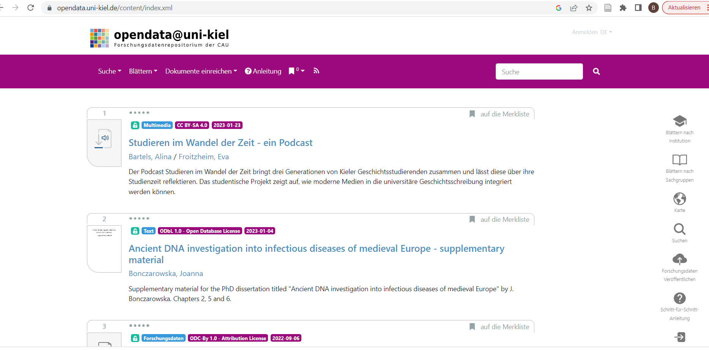

<!--

author:   Britta Petersen
email:    b.petersen@rz.uni-kiel.de
version:  0.2.0
language: de
narrator: DE German Female

link: https://raw.githubusercontent.com/RDM4CAU/Intro-to-RDM/refs/heads/main/cau-style.css

icon:     images/Logo_cau-norm-de-lilagrey-rgb-0720_2022.png

comment:  Einführung in das Thema Forschungsdatenmanagement im Rahmen der Veranstaltung biol116 - Kommunikation in der Wissenschaft, Prof. Olivia Roth

@style


.lia-slide__container {
    background-image: url("https://raw.githubusercontent.com/RDM4CAU/LZ4FDM/main/images/CAU-streifen.png");
    background-size: 3%;
    background-repeat: no-repeat;
    background-position: right;
    opacity: 1;

    position: relative; 
}

@end

-->

# Forschungsdatenmanagement

>**Britta Petersen**
>
>[Zentrales Forschungsdatenmanagement](https://www.fdm.uni-kiel.de/de)

<center>

<!-- style="width: 50%" -->

</center>

<div style="page-break-after: always;"></div>


# Disclaimer

>TinyURL zu dieser Präsentation: 

>**Disclaimer**: Please note that you are leaving the CAU pages once you open this presentation in your browser. This presentation includes links to other third party websites and services. When you click on these links you will leave this presentation and will be redirected to the respective another sites. These sites are not under our control.
>
>RDM@CAU is not responsible for the content of linked third party websites. Please be aware that the security and privacy policies on these sites may be different than CAU policies, so please read third party privacy and security policies closely.
>
> To see this document as an interactive LiaScript rendered version, click on the
> following link/badge:
>
> [](https://liascript.github.io/course/?https://raw.githubusercontent.com/RDM4CAU/bio116/refs/heads/main/2025_FDM_Biol-116.md#1)
>
> If you need help, feel free to ask us any questions:
>
> [b.petersen@rz.uni-kiel.de](mailto:b.petersen@rz.uni-kiel.de)
>
> ____________________________________________
>
>  This work is licensed under a [Creative Commons Attribution 4.0 International License](https://creativecommons.org/) with exception of the used material from other copyright holders.

<div style="page-break-after: always;"></div>

# Forschungsdaten...? 🧪

{{0-1}}
********************************************************************************

<!-- style="width: 100%" -->
>**Lassen Sie uns kurz gemeinsam sammeln!**
>
>Was sind Forschungsdaten?
>
>* Welche Beispiele für Forschungsdaten können Sie nennen?
>
>https://answergarden.ch/4024842
>
> Sie dürfen so viele Begriffe eingeben, wie Sie möchten.


********************************************************************************

{{1-2}}
********************************************************************************

<iframe src="https://answergarden.ch/4024842" style="border:0px;width:100%;height:500px" allowfullscreen="true" webkitallowfullscreen="true" mozallowfullscreen="true"></iframe>

<div style="page-break-after: always;"></div>

********************************************************************************

{{2-3}}
********************************************************************************
Die DFG schreibt hierzu:

> „Zu Forschungsdaten zählen u. a. Messdaten, Laborwerte, audiovisuelle Informationen, Texte, Surveydaten oder Beobachtungsdaten, methodische Testverfahren sowie Fragebögen. Korpora und Simulationen können ebenfalls zentrale Ergebnisse wissenschaftlicher Forschung darstellen und werden daher ebenfalls unter den Begriff Forschungsdaten gefasst. Da Forschungsdaten in einigen Fachbereichen auf der Analyse von Objekten basieren (z. B. Gewebe-, Material-, Gesteins-, Wasser- und Bodenproben, Prüfkörper, Installationen, Artefakte und Kunstgegenstände), muss der Umgang mit diesen ebenso sorgfältig sein und eine fachlich adäquate Nachnutzungsmöglichkeit, wann immer sinnvoll und möglich, mitgedacht werden. Ähnliches gilt, wenn Software für die Entstehung oder Verarbeitung von Forschungsdaten erforderlich ist.“
>
> [DFG - Umgang mit Forschungsdaten](https://www.dfg.de/de/grundlagen-themen/grundlagen-und-prinzipien-der-foerderung/forschungsdaten)

********************************************************************************

{{3-4}}
********************************************************************************

Etwas weniger kompliziert:

> Es existiert Keine feste Definition des Begriffes "Forschungsdaten"
>
>- **Allgemein**:
>
>  - Forschungsdaten sind „alle (digitalen) Daten, die während des Forschungsprozesses **entstehen**, **gesammelt**, oder **verarbeitet** werden sowie deren **Ergebnisse** sind“.
>
> [Biernacka et al. (2023) .Train-the-Trainer-Konzept zum Thema Forschungsdatenmanagement.](https://doi.org/10.5281/zenodo.10122153)

********************************************************************************

{{4}}
********************************************************************************

 <!-- width="350px" align="right" -->

**Beispiele für Forschungsdaten**:

- Audio- und Videoaufzeichnungen
- Tagebücher
- Daten aus geografischen Informationssystemen (GIS)
- Labor- und Feldnotizen
- Modell-, Skript- und Forschungssoftwarecode
- Bilder und Abbildungen
- Fragebögen und Codebücher
- Proben und Artefakte
- Sensor-Daten
- Sequenzierdaten
- Spektren
- Text- und Tabellenkalkulationsdokumente
- Textkorpora und Annotationen
- Topographie-Daten
- Abschriften

********************************************************************************

<div style="page-break-after: always;"></div>

# Forschungsdatenmanagement...? 🤹

{{0}}
********************************************************************************
 <!--
style="width: 20%; float:right"
title="Zusammenarbeit"
onclick="alert('Let´s work together!');"
-->

********************************************************************************

{{1-2}}
********************************************************************************
Forschungsdatenmanagement (FDM) …
---

… umfasst alle Aktivitäten, die mit der

- Aufbereitung,
- Speicherung,
- Archivierung und
- Veröffentlichung

von Forschungsdaten verbunden sind.

… begleitet den Forschungsprozess von den ersten Planungen bis zur Archivierung, Nachnutzung oder Löschung der Daten.[^1]  

<br>
<br>
<br>
<br>
<br>
<br>

---

[^1] [Biernacka et al. (2023) .Train-the-Trainer-Konzept zum Thema Forschungsdatenmanagement.](https://doi.org/10.5281/zenodo.10122153)


********************************************************************************

{{2}}
********************************************************************************

Zentrale Aspekte des FDM
---

- **Datenorganisation**

  - Strukturierung und Dokumentation der Daten, mit dem Ziel Auffindbarkeit und Nachvollziehbarkeit zu gewährleisten.

- **Datenqualität und -integrität**

  - Sicherstellung, dass die Daten korrekt, vollständig und zuverlässig sind.

- **Datensicherung**

  - Schutz vor Datenverlust, z. B. durch regelmäßige Backups und andere Sicherheitsmaßnahmen.

- **Datenarchivierung**

  - Langfristige Speicherung und Zugänglichmachung von Daten.

- **Datenzugang und -verfügbarkeit**

  - Sicherstellung, dass Daten für andere Forschende zugänglich sind, unter Berücksichtigung ethischer und rechtlicher Aspekte.

- **Datenethik und -recht**

  - Einhaltung gesetzlicher Bestimmungen, Datenschutzvorgaben und ethischer Richtlinien beim Umgang mit Forschungsdaten.

********************************************************************************

<div style="page-break-after: always;"></div>

# Leitprinzipien: FAIR 🎯

{{0-1}}
********************************************************************************

>Die **FAIR-Prinzipien** dienen als Leitprinzipien und Orientierungshilfe zur Erreichung des Ziels: ***Daten langfristig und personenunabhängig zugänglich, nachnutzbar und nachprüfbar zu halten.***

<!-- style="max-width: 90%; float:right" -->
.") 

********************************************************************************

{{1-2}}
********************************************************************************
<!-- style="font-size: 30px;" -->
>**F - ❔**
<!-- style="font-size: 30px;" -->
>**A - ❔**
<!-- style="font-size: 30px;" -->
>**I - ❔**
<!-- style="font-size: 30px;" -->
>**R - ❔**

********************************************************************************

{{2-10}}
<!-- style="font-size: 30px;" -->
>**F**indable

{{6-7}}
****************
Daten sollen so strukturiert und beschrieben werden, dass sie leicht auffindbar sind.

Dazu gehört die strukturierte Benennung von Dateien, die Verwendung eindeutiger digitaler Identifier (z. B. DOI, ORCID) und eine klare, vollständige Dokumentation (Metadaten).

Metadaten und Daten sollten sowohl für Menschen als auch für Computer leicht zu finden sein.

Maschinenlesbare Metadaten sind für das automatische Auffinden von Datensätzen und Diensten unerlässlich und daher ein wesentlicher Bestandteil FAIRer Daten.

***************

{{3-10}}
<!-- style="font-size: 30px;" -->
>**A**ccessible

{{7-8}}
***********************
Daten sollen unter klar definierten Bedingungen zugänglich sein. Sie sollten möglichst so zugänglich gemacht werden, dass sie auch langfristig, unabhängig von einer ursprünglichen Forschungsgruppe oder eines/einer einzelnen Forschenden, abgerufen werden können.

******************

{{4-10}}
<!-- style="font-size: 30px;" -->
>**I**nteroperable

{{8-9}}
**********************
Daten sollen in einer Form vorliegen, das es ermöglicht, sie mit anderen Datensätzen oder Softwaretools zu kombinieren, zu speichern und auszuwerten. 

Dies erfordert die Verwendung von offenen Standards und Formaten, die eine einfache Nutzung und Weiterverarbeitung ermöglichen.

**********************

{{5-10}}
<!-- style="font-size: 30px;" -->
>**R**eusable

{{9-10}}
***************
Das Ziel von FAIR ist es, die Wiederverwendung von Daten zu optimieren. Um dies zu erreichen, sollen Daten so aufbereitet werden, dass sie von anderen Forschenden für neue Forschungsfragen genutzt werden können. 

Dies bedeutet, dass sie Hinweise für eine rechtssichere Nutzung beinhalten (Lizenzangaben) und eine Dokumentation die nötigen Informationen bereitstellt, um die Daten korrekt interpretieren zu können.

**************

{{10}}
***************
><!-- style="font-size: 20px;" -->
>*** Das Original finden Sie hier: [The FAIR Guiding Principles for scientific data management and stewardship](https://www.nature.com/articles/sdata201618).***

***************

<div style="page-break-after: always;"></div>

# Forschungsdatenlebenszyklus ♻

Fragen zum Datenmanagement ergeben sich in allen Phasen des Forschungsprozesses:

{{0-1}}
************
<center>
 
</center>

************

<div style="page-break-after: always;"></div>

{{1-2}}
********************************************************************************
 <!-- width="150px" align="right" -->

Planung
---

**Findable**

- Nach welchem Schema benenne ich meine Dateien, damit sie im Projektverlauf möglichst gut zu finden sind?
- ...

**Accessible**:

- Wer soll mit welchen Rechten Zugang zu den Daten haben?
- ...

**Interoperable**:

- Mit welchen Dateiformaten und Tools soll gearbeitet werden?
- In welchen Dateiformaten soll veröffentlicht oder archiviert werden?
- ...

**Reusable**:

- Unter welchen Bedingungen darf ich die Daten nachnutzen?

- Welche Informationen oder Metadaten brauche ich, um die Daten nutzen zu können?
- ...

********************************************************************************

<div style="page-break-after: always;"></div>

{{2-3}}
********************************************************************************
 <!-- width="150px" align="right" -->

Erhebung und Analyse
---

**Findable**

- Welche Maßnahmen werden durchgeführt, um Verzeichnisse und Dateibenennungen konsistent zu halten?
- Welche Metadaten werden während der Datenerhebung erfasst, um die Daten später gut auffindbar zu machen?

**Accessible**

- Welche Backup Strategie wird verfolgt?
- Wie wird die Sicherheit sensibler Daten während der Projektlaufzeit gewährleistet (Zugriffs- und Nutzungsverwaltung)?

**Interoperabel** 

- Sind Maßnahmen erforderlich, um eine Interoperabilität mit anderen Datensätzen zu gewährleisten?

**Reusable**

- Welche Ansätze werden verfolgt, um die Daten kontinuierlich nachvollziehbar zu dokumentieren?


********************************************************************************
---

<div style="page-break-after: always;"></div>

{{3-4}}
********************************************************************************

 <!-- width="150px" align="right" -->

Archivierung & Veröffentlichung
---

**Findable**

- Welche Metadaten können die Daten gut auffindbar machen?
- Welche Infrastruktur ist für die Daten geeignet (z. B. eine generische vs. eine fachspezifische)

**Accessible**

- Welche Infrastruktur ist für eine Langzeitarchivierung geeignet?

**Interoperabel** 

- Existieren (fachliche) Normen, Standards oder Empfehlungen für Daten oder Metadaten, die berücksichtigt werden sollten?

**Reusable**

- Bestehen rechtlichen Besonderheiten im Zusammenhang mit dem Umgang mit den Daten?
* Existieren wichtige wissenschaftliche Kodizes bzw. fachliche Normen, die Berücksichtigung finden sollten?

---
********************************************************************************

<div style="page-break-after: always;"></div>

{{4-5}}
********************************************************************************

 <!-- width="150px" align="right" -->

Nachnutzung
---

**Findable**

- Sind die Daten mit ausreichend Metadaten versehen, um gefunden zu werden?

**Accessible**

- Werden die Daten für zukünftige Forscher:innen weiterhin zugänglich bleiben (z. B. durch stabile Repositorien und klare Lizenzvereinbarungen)?

**Interoperabel**

- Werden die Daten in einem Format gespeichert, das eine langfristige Nutzung ermöglicht?

**Reusable**

- Sind die Daten so gut dokumentiert, sodass neue Nutzer sie in unterschiedlichen Kontexten wiederverwenden können?
- Ab wann und unter welchen Bedingungen sind die Forschungsdaten für Dritte nutzbar?

********************************************************************************

<div style="page-break-after: always;"></div>


# Erste Schritte im FDM 🕺

<div style="text-align:center">
><p style="color:#9a047f">**Es mag banal erscheinen, aber eine strukturierte Ordner- und Dateibenennung ist ein erster Schritt im Forschungsdatenmanagement!**</p>
</div>

<center></center>

<div style="text-align:center">
<P><SMALL>https://xkcd.com/1459. Shared under CC-BY-NC License</SMALL></P>
</div>

<div style="page-break-after: always;"></div>

### Daten strukturiert ablegen

{{0-1}}
*************************
Verzeichnisse anlegen
---

<!-- style="width: 30%; float:right" -->


Entwickeln Sie eine logische Struktur mit klaren Hauptkategorien für Dateiordner, wie z. B.:

- Daten: Alle erhobenen und verarbeiteten Daten
    
- Arbeitsdokumente: Berichte, Protokolle, Notizen

- Literatur: Fachartikel, Bücher, Zitationen

- Ergebnisse: Abbildungen, Diagramme, Karten

- Bachelorarbeit: Textdateien Kapitelweise

\

Unterordner können z. B. Analysemethoden oder nach zeitlichen Phasen angelegt werden:

- Daten

  - Rohdaten
  
  - AnalyseX-Daten

  - AnalyseY-Daten
  
  - Publikationsdaten

<br>

- Legen Sie möglichst nicht mehr als drei Ordnerebenen an.

*************************

{{1-2}}
*************************
Dateibenennungskonventionen entwickeln 
---

>- Klare, konsistente Namen für Dateien
>- Dateinamen kurz, aber präzise

>- **Muster für Bestandteile der Dateinamen entwickeln!**
>
>  - z. B. Projektname-Typ-Datum-Version.suffix -> z. B. „ProjektXY-RTPCR-Art-20250120-v1.csv“
>
>  - Muster einhalten!
>  - Abkürzungen Dokumentieren (z. B. RTPCR = Realtime-PCR)

>- [***ISO 8601***](https://en.wikipedia.org/wiki/ISO_8601) für Daten und Zeiten
>
>   - Datum: JJJJ-MM-TT

>- Viele Proben? Führende Nullen verwenden (z. B. 001, 002, ...)

>- **Versionen?**
>
>  - Vermeiden Sie Anhänge, wie \_final, \_fertig, \_inArbeit u. ä.
>
>  - Verwenden Sie das [***semantische Versionsschema***](https://semverdoc.org/) (Major-Minor-Patch), z. B. v1 v2-0

>- **Vermeiden Sie Leerzeichen und sämtliche Sonderzeichen "🦄".** 
>
>  - einzig erlaubte Sonderzeichen sind Unterstrich (_) und Bindestrich (-)

*************************

{{2}}
*************************

- ***Dokumentieren*** Sie in einer sogenannten ***README-Datei***

  - Ihre Ordnerstruktur
  
  - Benennungskonventionen
  
  - verwendete Abkürzungen

  - Versionierungsschema

Lesen Sie README-Dateien, wenn Sie in gemeinsam genutzten Speicherorten welche finden :-)

*************************

<div style="page-break-after: always;"></div>

# Beispiel Benennungskonvention

{{0-1}}
****************************************
<!-- style="font-size: 30px;" -->
>Project name\_Approach\_Location\_Person-ID_Date.[Format-Suffix]
>
>Rebel-Hunting\_Interview\_DS-1\_Organa\_2001-05-12.mp4
****************************************

{{1}}
****************************************

<!-- style="font-size: 30px;" -->
Datum nicht nach ISO 8601. ACHTUNG!🚫

<!-- style="font-size: 30px;" -->
>Rebel-Hunting\_Interview\_DS-1-Orbital-Battle-Station\_Organa\_01-05-12.mp4

****************************************

<div style="page-break-after: always;"></div>

### Beispiel README

>Ordnerstrukturen und Namenskonventionen sollten in einer **README-Datei** dokumentiert werden, die als einfache Textdatei in der ersten hierarchischen Ebene der gewählten Ordnerstruktur abgelegt werden sollte.

{{1}}
********************************************************************************

Eine README-Datei könnte so aussehen:

```markdown
**~~GENERAL~~**
This README reffers to all files related to

Project: Study project for the course Research Data Management in Prehistoric Archaeology

Description: [Short description of the project]

Course: Research Data Management in Prehistoric Archaeology

Lecturer(s): [Names]

last updated: 2023-07-10

**~~FOLDER~~**

All files related to the project live in the folder ***AnyStudyProject***, with content organized into subfolders as follows:

– ***RawData***: All raw data goes into this folder, subfolders organized by date if applicable

– ***AnalysedData***: Data files to be analysed, subfolders organized by date if applicable

– ***Figures***: Figures created from analysis files

– ***StudyThesisDrafts***: Draft of study thesis, including text, figures, outlines

– ***References***: Library of my references

– ***AnalogDocumentation***: Scanned copies of my written research notes and other research notes

– ***Miscellaneous***: Other information that relates to this project

**~~FILE NAMING~~**

Raw data files will be named as follows:

“raw_YYYYMMDD\_area\_object\_condition”
(example: “raw_20230701\_Bov\_bs\_2.csv”)

Analysis data files will be named as follows:

“YYYYMMDD\_area\_object\_condition_version”
(example: “20230701\_Bov\_bs\_2_v1-1.csv”)

**Abbreviations** in use:

*area*: KI=Kiel, Bov=Bovenau, Emk=Emkendorf

*objects*: bs=blade scraper, B=hatchet

*condition*: 1=fully preserved, 2=partly preserved, 3=poorly preserved/fragment

**~~VERSIONING~~**

Version information is given in the form of a major-minor specification in the file name (vmajor-minor).

**major changes**: Extensive corrections, adjustments or additions to a data set or text file, such as a large number of additional entries in a table or extensive cleaning of data or addition of a chapter to a text. In this case, the version number increases in steps of one ("major" number + 1), e.g. from version 2.0 to version 3.0. If the "major" version number is changed, the "minor" version number must be numbered upwards again starting from "0" (e.g. version change from 2.14 to 3.0).

**minor changes**: The version number in second place ("minor") increases by +1 if minor corrections have been made, such as the correction of spelling and typing errors in texts or tables.

**~~STORAGE~~**

All files will be stored on my computer and backed up [daily,weekly,...] to CAU Cloud and and an external hard disk.

**Version control**

| Versionsnr.  | Changes                | Date       | changed by        |
| :----------  | :----------            | ---        | ---               |
| 0-1          | setup working folders  | 2023-09-02 | me                |


```

********************************************************************************

<div style="page-break-after: always;"></div>

### Widerholen und vertiefen

https://tinyurl.com/dateibenennung


<div style="page-break-after: always;"></div>

# Wissenschaftliche Tagung

> <!-- width="150px" align="right" -->
>
>Sie sind Teil eines Organisationsteams und planen eine wissenschaftliche Tagung.
>
>**Tauschen Sie sich kurz mit 2-3 benachbarten Personen aus.**
>
>**Welche Aspekte des Datenmanagement könnten für Planung, Durchführung und Nachbereitung Ihrer Tagung relevant sein?**

<div style="page-break-after: always;"></div>

{{1}}
********************************************************************************

Einige mögliche Punkte 
---

**Vorbereitungen**

* Orga-Team intern:

  * Einigung auf Ordnerstrukturen und Benennungskonventionen
  * Einigung auf Speicherorte und Back-Up Strategien
  * Datenzugriff und Zugriffssicherheit (personenbezogene Daten)
  * Einigung auf zu nutzende Tools für kollaboratives Arbeiten

* Call for Abstracts:

  * Vorgaben für Dateibenennungen
  * Vorgaben für Dateiformate
  * Vorgaben für max. Dateigrößen
  * Vorgaben zu Zitationsstilen, ggf. zu Formaten von Bibliotheken (z. B. BibTeX)
  * Abfragen von eindeutigen Identifiern der Autor*innen (ORCID)
  * Lizenz- und Copyright-Vereinbarungen
  * Datenschutz (Umgang mit personenbezogenen Daten)

---

********************************************************************************

{{3}}
********************************************************************************

**Durchführung**:

* Vorgaben bzgl. zu nutzender Präsentationstools
* Vorgaben für Dateiformate
* Vorgaben bzgl. weiterer ggf. zu nutzenden Tools (z. B. interaktive Boards, Umfragetools, gemeinsame Bibliotheken (z.B. Zotero-Gruppen), etc.)
* Datenschutz (Umgang mit personenbezogenen Daten)

---

********************************************************************************

{{4}}
********************************************************************************

**Nachbereitung / Veröffentlich von Ergebnissen**:

* Vorgaben für Dateibenennungen
* Vorgaben für Dateiformate
* Vorgaben für max. Dateigrößen
* Vorgaben zu Zitationsstilen, ggf. Formate von Bibliotheken (z. B. BibTeX)
* Abfragen von eindeutigen Identifiern der Autor*innen (ORCID)
* Lizenz- und Copyright-Vereinbarungen
* Publikationsorte
* Publikationsarten

********************************************************************************

<div style="page-break-after: always;"></div>

# opendata@uni-kiel.de

Sie schreiben bald eine Bachelorarbeit.

Denken Sie jetzt schon daran, wie Sie Ihre Daten nachhaltig aufbewahren können: https://opendata.uni-kiel.de

>Auf dem Testsytem (nur CAU-intern erreichbar) kann das Publizieren ausprobiert werden: https://datenrepositorium00.rz.uni-kiel.de



<div style="page-break-after: always;"></div>

# FDM & GWP  🧚

> <!-- width="150px" align="right" -->
>
> **Kurzer Ausblick in ein anderes Vorlesungsthema**
>
>* Gutes Forschungsdatenmanagement gilt als ein Teil **~~guter wissenschaftlicher Praxis~~ (GWP)**.
>
> Was denken Sie? Inwiefern kann FDM zu GWP beitragen?

<div style="page-break-after: always;"></div>

# Berufliche Perspektiven

> Mit wissenschaftlicher Expertise ***und*** guten Kenntnissen im Bereich des Datenmanagements entstehen zusätzliche berufliche Perspektiven innerhalb Fachwissenschaften sowie in zentralen Einrichtungen, wie etwa Rechenzentren, Universitätsbibliotheken, Landesinitiativen oder Konsortien der NFDI.
>
> Mögliche Berufsbezeichnungen für diese Tätigkeitsbereiche sind z. B.:
>
> * Data Steward,
> * Data Curator und/oder
> * Data Collector
>
> Hierfür sind gute Kenntnisse und Fähigkeiten im Umgang mit digitalen Daten erforderlich, die über rein fachliche Fragestellungen hinaus gehen. Momentan fehlt in den meisten Fachbereichen eine formale Ausbildung in diesem Bereich.

<div style="page-break-after: always;"></div>

# Herzlichen Dank!

 <!-- width="250px" align="right" -->

Mehr zum FDM an der CAU finden Sie hier:

https://www.fdm.uni-kiel.de/de

<div style="page-break-after: always;"></div>

# Quellen

Biernacka, Katarzyna, Buchholz, Petra, Danker, Sarah Ann, Dolzycka, Dominika, Engelhardt, Claudia, Helbig, Kerstin, Jacob, Juliane, Neumann, Janna, Odebrecht, Carolin, Petersen, Britta, Slowig, Benjamin, Trautwein-Bruns, Ute, Wiljes, Cord, & Wuttke, Ulrike. (2021). Train-the-Trainer-Konzept zum Thema Forschungsdatenmanagement (Version 4). Zenodo.; https://doi.org/10.5281/zenodo.5773203

DFG - Umgang mit Forschungsdaten (2025), online unter https://www.dfg.de/de/grundlagen-themen/grundlagen-und-prinzipien-der-foerderung/forschungsdaten, letzer Zugriff 2026-01-18

Jackenkroll, Martina (2021): Wie organisiere ich meine Dateien und Ordner? Einführung in das Forschungsdatenmanagement; online unter https://www.tu-chemnitz.de//ub/dokumente/open_access/fdm/2021_02_26_ZfwN_FDM.pdf

Petersen, Britta, Engelhardt, Claudia, Hörner, Tanja, Jacob, Juliane, Kvetnaya, Tatiana, Mühlichen, Andreas, Schranzhofer, Hermann, Schulz, Sandra, Slowig, Benjamin, Trautwein-Bruns, Ute, Voigt, Anne, & Wiljes, Cord. (2022). Lernzielmatrix zum Themenbereich Forschungsdatenmanagement (FDM) für die Zielgruppen Studierende, PhDs und Data Stewards (Version 1). Zenodo. https://doi.org/10.5281/zenodo.7034478

Wilkinson, M., Dumontier, M., Aalbersberg, I. et al. The FAIR Guiding Principles for scientific data management and stewardship. Sci Data 3, 160018 (2016). https://doi.org/10.1038/sdata.2016.18 
